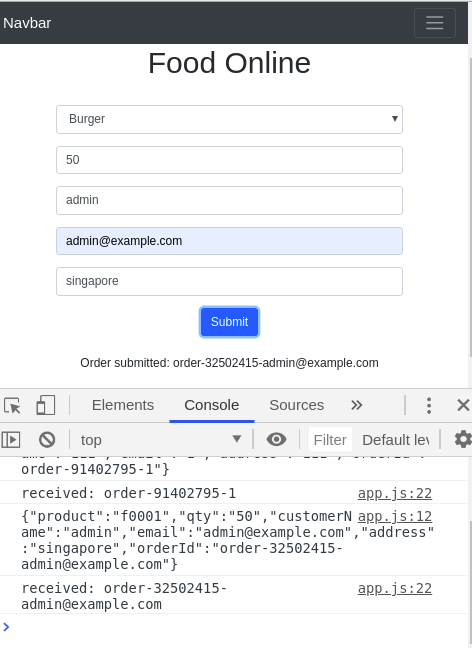

# Simple UI page 

Basic UI function to capture a simple food order 




Payload ready to be sent to backend server

```
{"product":"f0003","qty":"12","customerName":"John","email":"test@gmail.com","address":"AXA Tower","orderId":"order-44708541-test@gmail.com"}
```


#### Running on nodejs

`npm start` 

`http://<host>:8080/`
